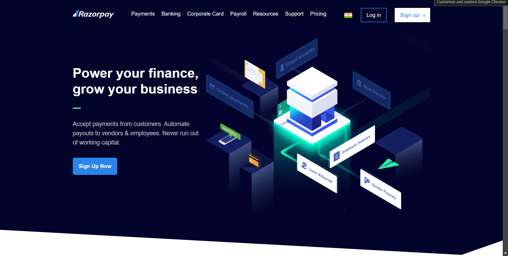

## 🚀 Razorpay Frontend Clone with Tailwind CSS
Welcome to the Razorpay Frontend Clone project! 🎉 This repository is a simple yet powerful recreation of the Razorpay interface, designed to help you practice and master Tailwind CSS.

## 🖼️ About This Project
This project focuses solely on the frontend using Tailwind CSS. It’s a perfect playground to:

Explore Razorpay's modern UI design.
Practice responsive design with Tailwind.
Enhance your frontend development skills.
🛠️ Tech Stack
HTML5: The backbone of the project.
Tailwind CSS: Utility-first CSS framework for rapid styling.
JavaScript (Optional): Add interactivity if needed.
## ✨ Features
Tailwind-Based Design: Clean and responsive layouts styled entirely with Tailwind classes.
Responsive UI: Fully optimized for all devices—mobile, tablet, and desktop.
Minimal Code: Focus on simplicity and readability.
Reusable Classes: Modular and efficient styling.
## 🌟 Why This Project?
This clone provides a hands-on way to:

Practice Tailwind's utility classes in real-world layouts.
Experiment with layouts, spacing, colors, and more.
Build a visually appealing interface inspired by Razorpay.
## 🚀 Getting Started
Clone the Repository
  
cd razorpay-frontend-clone  
Install Dependencies (Optional, if using Tailwind CLI or tools)

bash
Copy code
npm install  
Run the Project

Open index.html in your browser.
Or use a live server for a better development experience.
📸 Preview
✨ Home Page

💡 Learning Outcomes
Master utility-first CSS with Tailwind CSS.
Understand responsive web design principles.
Create clean, scalable, and professional UIs.
📬 Feedback
Loved the project? Drop a ⭐️ or share your thoughts!

Let’s make coding beautiful with Tailwind CSS! 🌟
